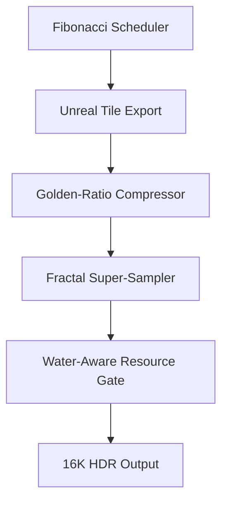

## 🌌 SlizzAi v3.6 — Eco-Intelligent HDR Image Generation Framework

SlizzAi v3.6 is a production-grade rendering and image-processing pipeline that fuses photorealistic fidelity, fractal-trained super-sampling, golden-ratio compression, and sustainable resource management. Built atop Unreal Engine 5’s Nanite and Lumen systems, it delivers 16K HDR imagery under a 1-liter/day cooling budget — redefining creative infrastructure for artists, studios, and simulation labs.

---

### 🔧 Key Features

| Feature | Description |
|--------|-------------|
| 🌐 **Fibonacci Frame Scheduler** | Golden-ratio tile distribution for efficient render coverage |
| 🧠 **Fractal AI Super-Sampling** | ESRGAN-style enhancement trained on fractal datasets |
| 🌀 **Golden-Ratio LOD Compression** | Mesh and texture delta compression with minimal fidelity loss |
| 💧 **Water-Aware Resource Manager** | Tracks thermal emissions and enforces eco-limits in real time |
| 🔲 **Nanite + Lumen Hybrid Integration** | UE5 virtual geometry + global illumination for ultra fidelity |
| ♻️ **Eco-Efficient Pipeline** | Full-day rendering under 1L cooling constraint |

---

### 🧬 Codex v3.5 — Procedural AI Creative Engine

SlizzAi-Codex-3.5.py introduces a GUI-driven orchestration layer for procedural 3D modeling, physics simulation, animation styling, and real-time Unreal sync. It includes:

- Visual prompt styling (anime, tactical, cinematic)
- Self-learning mesh generation
- Organism evolution based on biome/environment
- Pose retargeting and destruction simulation
- Energy VFX (Power Equator) with live sliders
- Bi-directional Unreal Engine bridge

---

### 🧪 Architecture Overview



Each module operates asynchronously to optimize render coverage and minimize environmental impact.

---

### 🚀 Quick Start

```bash
git clone https://github.com/Slizzurp/SlizzAi-3.git
cd SlizzAi-3
python SlizzAi-3.6.py -c config.yaml
```

Sample `config.yaml`:
```yaml
num_tiles: 24
output_dir: "./outputs"
super_sampler_url: "http://localhost:5000"
water_limit: 1.0
loop_delay: 0.05
```

---

### 🧠 Tech Stack

- Python 3.10+
- Unreal Engine 5.x (Nanite / Lumen)
- PyTorch (ESRGAN fractal model)
- Docker (for super-sampler microservice)
- PIL / NumPy / psutil / Tkinter

---

### 📜 License

Distributed under the MIT License. See `LICENSE` for details.

---

### 🌱 Vision

SlizzAi v3.6 isn’t just about rendering — it’s about reshaping how technology intersects with sustainability. Every pixel rendered reflects a step toward eco-conscious creativity.
